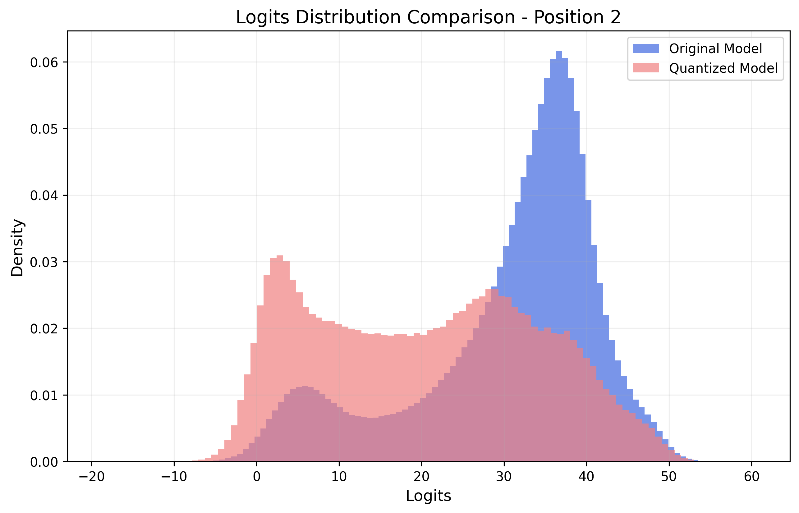
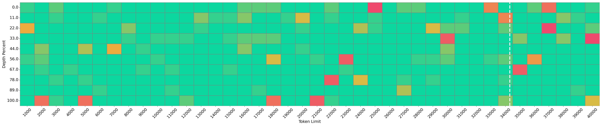
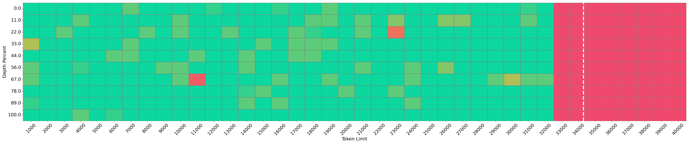

<h1 align="center">🤖 ACBench 🔬</h1>
<h3 align="center">🤔 Can Compressed LLMs Truly Act? An Empirical Evaluation of Agentic Capabilities in LLM Compression 📊</h3>

<p align="center">
  <a href="https://arxiv.org/abs/2505.xxxxx">📄arXiv</a> •
  <a href="https://github.com/pprp/ACBench">🌐GitHub</a>
</p>

<p align="center">
  <a href="https://github.com/pprp/ACBench"></a>
  <a href="https://opensource.org/licenses/MIT"></a>
</p>

## Table of Contents

- [Overview](#overview)
- [Abstract](#abstract)
- [Installation](#installation)
- [Evaluation](#evaluation)
- [Citation](#citation)


## Overview

Post-training compression reduces the computational and memory costs of large language models (LLMs), enabling resource-efficient deployment. However, existing compression benchmarks focus narrowly on language modeling (e.g., perplexity) and natural language understanding tasks (e.g., GLUE accuracy), ignoring the agentic capabilities—workflow, tool use/function call, long-context understanding and real-world application.

We introduce the Agent Compression Benchmark (ACBench), the first comprehensive benchmark for evaluating how compression impacts LLMs' agentic abilities. ACBench spans:

- 12 tasks across 4 capabilities (e.g., WorfBench for workflow generation, Needle-in-Haystack for long-context retrieval)
- 4-bit quantization (GPTQ, AWQ) and 50% pruning (Wanda, SparseGPT)
- 15 models, including small (Gemma-2B), standard (Qwen2.5-7B), and distilled reasoning LLMs (DeepSeek-R1-Distill)

## Abstract

Post-training compression reduces the computational and memory costs of large language models (LLMs), enabling resource-efficient deployment. However, existing compression benchmarks focus narrowly on language modeling (e.g., perplexity) and natural language understanding tasks (e.g., GLUE accuracy), ignoring the agentic capabilities—_workflow_, _tool use/function call_, _long-context understanding_ and _real-world application_. We introduce the **Agent Compression Benchmark (ACBench)**, the first comprehensive benchmark for evaluating how compression impacts LLMs' agentic abilities. ACBench spans (1) 12 tasks across 4 capabilities (e.g., WorfBench for workflow generation, Needle-in-Haystack for long-context retrieval), (2) 4-bit quantization (GPTQ, AWQ) and 50% pruning (Wanda, SparseGPT), and (3) 15 models, including small (Gemma-2B), standard (Qwen2.5-7B), and distilled reasoning LLMs (DeepSeek-R1-Distill). Our experiments reveal compression tradeoffs: 4-bit quantization preserves workflow generation and tool use (1%--3% drop) but degrades real-world application accuracy by 10%--15%. We introduce _ERank_, _Top-k Ranking Correlation_ and _Energy_ to systematize analysis. ACBench provides actionable insights for optimizing LLM compression in agentic scenarios, bridging the gap between algorithmic efficiency and real-world applicability.

## Installation

```bash
git clone https://github.com/pprp/ACBench
cd ACBench
pip install -r requirements.txt
pip install -e .
```

## Evaluation

ACBench builds upon and extends several excellent agentic benchmarks and compression toolkits. We integrate these benchmarks into our evaluation pipeline while preserving their original settings. For efficient model serving and evaluation, we utilize VLLM to deploy the compressed language models.

For detailed implementation and usage instructions, please refer to the corresponding subfolders in the `thirdpartys` directory. Each subfolder contains the original benchmark code along with our modifications to support compressed model evaluation. For experiment result on WorfBench, we have integrated it in acbench.

### A Demo for WorfBench

Taking WorfBench as example, we can run using the following scripts:

```
#!/bin/bash

MODEL=$1
TEMP=$2
QUANT=$3

DEVICE=${4:-6}

export CUDA_VISIBLE_DEVICES=$DEVICE

tasks=(wikihow toolbench toolalpaca lumos alfworld webshop os)

MODEL_NAME=$(basename $MODEL)

for task in ${tasks[@]}; do
    python agentbench/node_eval.py \
        --task gen_workflow \
        --model_name ${MODEL} \
        --gold_path ./data/gold_traj/${task}/graph_eval.json \
        --pred_path ./data/pred_traj/${MODEL_NAME}/${task}/${MODEL_NAME}/graph_eval_two_shot.json \
        --task_type ${task} \
        --few_shot \
        --temperature ${TEMP} \
        --quantization ${QUANT}
done
```

### Agentic Tasks

For Agentic Tasks:

- WorfBench: Benchmarking Agentic Workflow Generation [](https://arxiv.org/abs/2410.07869) [](https://github.com/zjunlp/WorfBench)
- AgentBoard: An Analytical Evaluation Board of Multi-turn LLM Agents [](https://arxiv.org/abs/2401.13178) [](https://github.com/hkust-nlp/agentboard)
- KVCache-Factory: Unified KV Cache Compression Methods for Auto-Regressive Models [](https://arxiv.org/abs/2406.02069) [](https://github.com/Zefan-Cai/KVCache-Factory)
- LongBench: A Bilingual, Multitask Benchmark for Long Context Understanding [](https://arxiv.org/abs/2308.14508) [](https://github.com/THUDM/LongBench)
- SCOPE: Optimizing Key-Value Cache Compression in Long-context Generation [](https://arxiv.org/pdf/2412.13649) [](https://github.com/Linking-ai/SCOPE)
- T-Eval: Evaluating Tool Utilization Capability of LLMs Step by Step [](https://arxiv.org/abs/2312.14033) [](https://github.com/open-compass/T-Eval)

### Compression

For Compression:

- Wanda: A Simple and Effective Pruning Approach for Large Language Models [](https://arxiv.org/abs/2306.11695) [](https://github.com/locuslab/wanda)
- LLMC: Benchmarking Large Language Model Quantization with a Versatile Compression Toolkit [](https://arxiv.org/abs/2405.06001) [](https://github.com/ModelTC/llmc)
- QLLM-Eval: Evaluating Quantized Large Language Models [](https://arxiv.org/abs/2402.18158) [](https://github.com/thu-nics/qllm-eval)

For fast serving, we employ [](https://github.com/vllm-project/vllm) for evaluation.

## Visualization

Energy-based analysis:

|   |   |  |
| :-------------------------------------------------------------------: | :-------------------------------------------------------------------: | :-------------------------------------------------------------------: |
|  |  |  |

Logits Visualization:

|   |   |  |
| :----------------------------------------------------------------------: | :----------------------------------------------------------------------: | :----------------------------------------------------------------------: |
|  |  |  |

Needle Visualization:

### InternLM Models

|           |       |       |
| :--------------------------------------------------------------------------: | :-----------------------------------------------------------------------: | :---------------------------------------------------------------------------: |
|       |     |  |
|  |  |       |

### Qwen Models

|           |          |            |
| :-----------------------------------------------------------------------: | :-----------------------------------------------------------------------: | :------------------------------------------------------------------------: |
|       |        |  |
|  |     |       |
|        |  |   |
|          |    |     |

### Distilled/Megrez Models

|  |  |
| :---------------------------------------------------------------------: | :----------------------------------------------------------------------: |
|   |           |

## Citation

If you use our work, please cite:

```
@inproceedings{dong2025compressed,
  title     = {Can Compressed LLMs Truly Act? An Empirical Evaluation of Agentic Capabilities in LLM Compression},
  author    = {Peijie Dong and Zhenheng Tang and Xiang Liu and Lujun Li and Xiaowen Chu and Bo Li},
  booktitle = {International Conference on Machine Learning (ICML)},
  year      = {2025}
}
```
